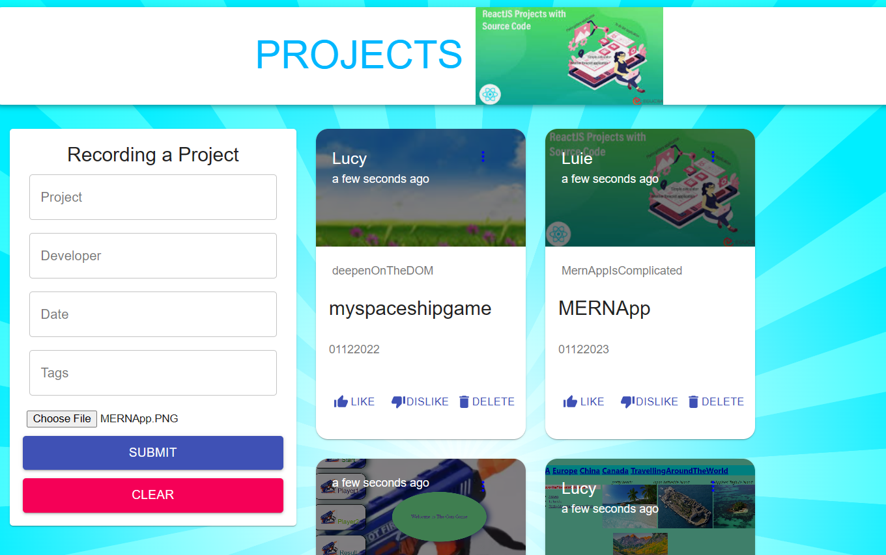
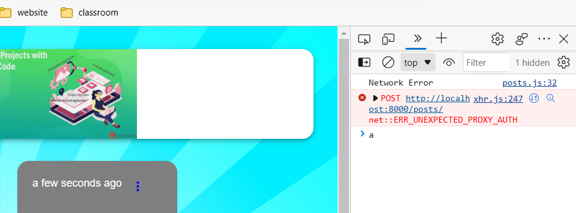
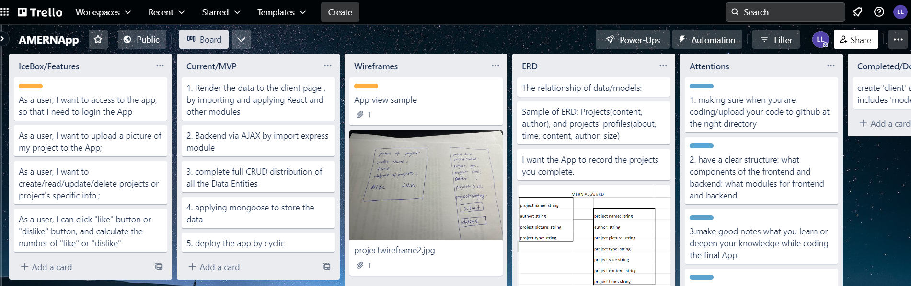

<h1>Introduction: </h1>
<h3> Images: </h3>

1. I am interested this finalMERNApp because I want to record my projects even they are not perfect; in doing so, I can keep records of my software career development. While coding, I review what I learn and learn some new skills, super meaningful. 
2. Some errors that I correct: 2.1 'useFindAndModify' is not valid option to server index.js nowadays. (//mongoose.set('useFindAndUpdate', false); ); 2.2
3. Some error of my code:  , 

<h1> Technologies/API/libraries</h1>
Technologies Used:
<h5> axios: </h5>Promise based HTTP client for the browser and node.js; connect frontend and backend by URL of backend
 <h5> express:</h5> create backend's server, comparing with http, express is fast and convenient
 <h5> react: </h5> the JavaScript library for building user interfaces, client side , frontend, quickly to update the state/data
 <h5> react-dom:</h5>compared to import modules(react.js), react-dom provide DOM-specific methods by applying CommadJS. 
 <h5> momnet:</h5>recording the time of your data/modules are created
 <h5> react-file-based64: </h5>
 <h5>react-redux: </h5>redux is one way for function or stateless data (not class/stateful data) to update redux allows React components to read data from a Redux Store, and dispatch Actions to the Store to update data. Redux helps apps to scale by providing a sensible way to manage state through a unidirectional data flow model. React Redux is conceptually simple.
 <h5>cors: </h5>Cross-Origin Resource Sharing (CORS) is an HTTP-header based mechanism that allows a server to indicate any origins (domain, scheme, or port) other than its own from which a browser should permit loading resources.
 <h5>body-parser: </h5>body parsing is important middleware; the user can get the data by POST, PATCH, PUT,to CRUD data
 <h5>mongoose: </h5> set up model/data 
 <h5>hook</h5>: allow you to get the exact part of API/libraries to write your project, not change the stateful logic hierarchy.

<h1>Getting Started </h1>: see my Trello board.

<h1>Unsolved Problems:</h1> The biggest challenges: I have some trouble to create a module at the frontend brower page; sometimes I suceed in creating it, sometimes not. I need to figure out it; the new vision of vscode or node or express create some conflicts or unnecessaries, like "<ThumbDownAltIcon fontSize='small' />" the fontSize can not be default, but maybe years ago, the ThumbDownAltIcon props fontSize can be default.
the biggest takeaway: I can succeed in create a module at my App Project browser that I spent almost two days to figure out.

<h1>Future features:</h1> 
1. I want to modify the App by applying CSS to make the app more pretty;
2. To creating more functions, for example: "Nav function" if you click the project which will lead you to the github code,
"comment area" a button you can comment the projects.

<h1>My plan for this project:<h1>
 keeping working on it, firstly solve the iusse to create a module stably, maybe it is the laptop issue or internet problem. Secondly,  add more functions to the projects. Not only this project, I will also keep working on other projects. 

  

# Getting Started with Create React App

This project was bootstrapped with [Create React App](https://github.com/facebook/create-react-app).

## Available Scripts

In the project directory, you can run:

### `npm start`

Runs the app in the development mode.\
Open [http://localhost:3000](http://localhost:3000) to view it in your browser.

The page will reload when you make changes.\
You may also see any lint errors in the console.

### `npm test`

Launches the test runner in the interactive watch mode.\
See the section about [running tests](https://facebook.github.io/create-react-app/docs/running-tests) for more information.

### `npm run build`

Builds the app for production to the `build` folder.\
It correctly bundles React in production mode and optimizes the build for the best performance.

The build is minified and the filenames include the hashes.\
Your app is ready to be deployed!

See the section about [deployment](https://facebook.github.io/create-react-app/docs/deployment) for more information.

### `npm run eject`

**Note: this is a one-way operation. Once you `eject`, you can't go back!**

If you aren't satisfied with the build tool and configuration choices, you can `eject` at any time. This command will remove the single build dependency from your project.

Instead, it will copy all the configuration files and the transitive dependencies (webpack, Babel, ESLint, etc) right into your project so you have full control over them. All of the commands except `eject` will still work, but they will point to the copied scripts so you can tweak them. At this point you're on your own.

You don't have to ever use `eject`. The curated feature set is suitable for small and middle deployments, and you shouldn't feel obligated to use this feature. However we understand that this tool wouldn't be useful if you couldn't customize it when you are ready for it.

## Learn More

You can learn more in the [Create React App documentation](https://facebook.github.io/create-react-app/docs/getting-started).

To learn React, check out the [React documentation](https://reactjs.org/).

### Code Splitting

This section has moved here: [https://facebook.github.io/create-react-app/docs/code-splitting](https://facebook.github.io/create-react-app/docs/code-splitting)

### Analyzing the Bundle Size

This section has moved here: [https://facebook.github.io/create-react-app/docs/analyzing-the-bundle-size](https://facebook.github.io/create-react-app/docs/analyzing-the-bundle-size)

### Making a Progressive Web App

This section has moved here: [https://facebook.github.io/create-react-app/docs/making-a-progressive-web-app](https://facebook.github.io/create-react-app/docs/making-a-progressive-web-app)

### Advanced Configuration

This section has moved here: [https://facebook.github.io/create-react-app/docs/advanced-configuration](https://facebook.github.io/create-react-app/docs/advanced-configuration)

### Deployment

This section has moved here: [https://facebook.github.io/create-react-app/docs/deployment](https://facebook.github.io/create-react-app/docs/deployment)

### `npm run build` fails to minify

This section has moved here: [https://facebook.github.io/create-react-app/docs/troubleshooting#npm-run-build-fails-to-minify](https://facebook.github.io/create-react-app/docs/troubleshooting#npm-run-build-fails-to-minify)
